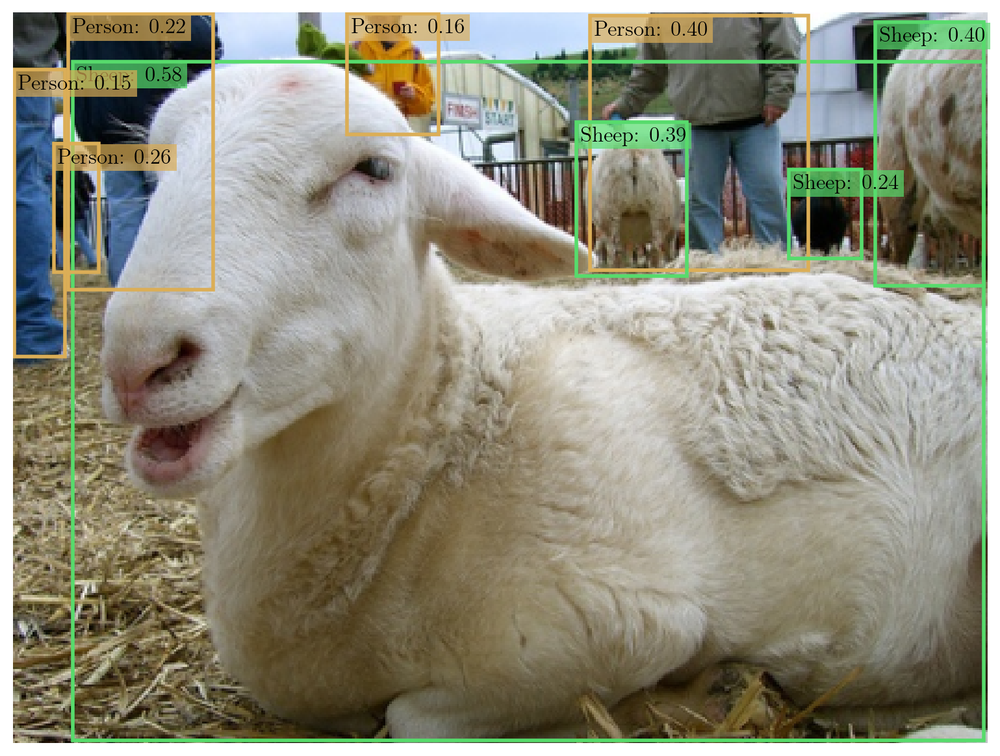
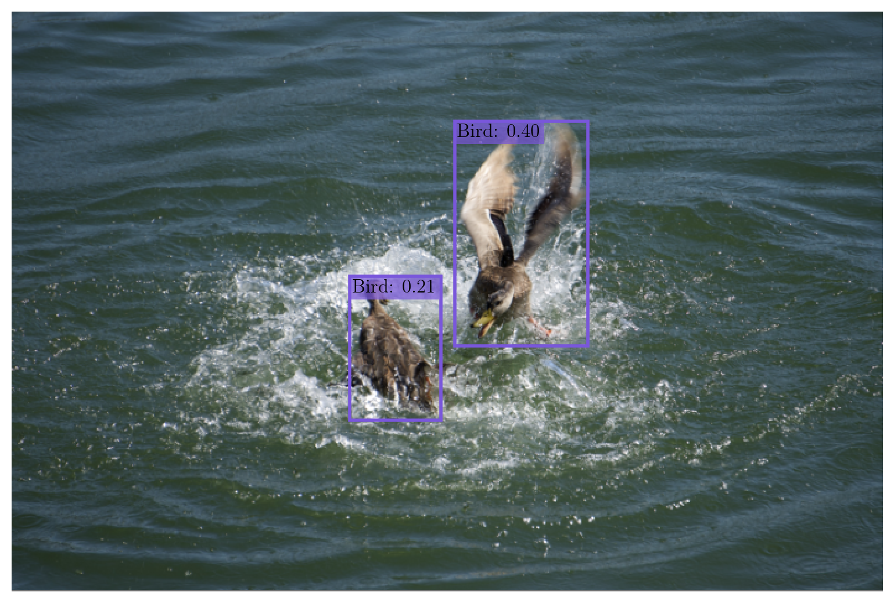

# A PyTorch Implementation of YOLOv3
This project uses the PyTorch framework to implement the YOLOv3 architecture, along with a training pipeline that incorporates various techniques (e.g. multiscale training, mosaic augmentations) to improve generalization.

## Table of Contents
- [Project Overview](#project-overview)
- [Recommended Installation Instructions](#recommended-installation-instructions)
- [Custom Dataset Instructions](#custom-dataset-instructions)
- [Training Instructions](#training-instructions)
- [References](#references)

## Project Overview
<p align = 'center'>
  
  
</p>

The third iteration of the _You Only Look Once_ model, YOLOv3, was proposed by [Redmon & Farhadi (2018)](#references) and presents several architectural improvements over its predecessors: YOLOv2 [(Redmon & Farhadi 2017)](#references) and YOLOv1 [(Redmon et al. 2016)](#references). It introduces a more powerful backbone called _DarkNet-53_, which is comprised of deeper layers with batch normalization and interwoven residual connections for better feature extraction. Moreover, YOLOv3's detector now includes a _feature pyramid network (FPN)_, enabling predictions at three different scales — large, medium, and small — to improve detection across a range of object sizes.

For _object localization,_ YOLOv3 follows YOLOv2 in adopting an anchor-based strategy that constructs bounding boxes by applying predicted offsets to a fixed set of anchor boxes (these act as priors, typically determined using k-means clustering). These predictions are treated as a standard regression task that is optimized using _mean squared error (MSE)_. For _class prediction_, YOLOv3 treats each class as an independent logistic regression problem as opposed to using a single softmax over all classes. This allows the model to handle multi-label situations where an object may belong to multiple classes simultaneously. In a similar manner, the _objectness confidence_ is now handled as a logistic regression problem, with the prediction representing the probability that an object exists in a given anchor box (`P(object)`) instead of the product of objectness and localization quality (`P(object) * IoU`) seen in earlier versions of YOLO [(Redmon & Farhadi 2018)](#references).

The architecture used in this project is a faithful reproduction of YOLOv3 by [Redmon & Farhadi (2018)](#references), built using the official configuration files from the [DarkNet GitHub repository](https://github.com/pjreddie/darknet) and pretrained weights from [pjreddie.com](https://pjreddie.com/). This configuration-based approach was inspired by a previous implementation of the YOLOv3 detector done by [ayooshkathuria](https://github.com/ayooshkathuria/YOLO_v3_tutorial_from_scratch/tree/master). A key distinction lies in the training pipeline, which incorporates several optional techniques used by [Zhang et al. 2019](#references) and [Ge et al. 2021](#references) to improve generalization and accuracy. These include:
-  IoU-based coordinate loss (IoU, GIoU, DIoU, and CIoU)
-  Focal loss for object confidence
-  Softmax for class prediction in single-label scenarios
-  Label smoothing for classification
-  Cosine annealing learning rate scheduler
-  Multi-scale training (also used in the original paper)
-  Multi-image augmentations (mosaic and mix-up)
-  Exponential moving average (EMA) of model weights


<br></br>
## Recommended Installation Instructions
### 1) Create a New Python Environment
This environment should use **Python >= 3.10**.
### 2) Clone the `yolov3-pytorch` Repository
```
git clone git@github.com:Jechen00/yolov3-pytorch.git
```
### 3) Install Required Packages
Navigate to the `yolov3-pytorch` directory and run:
```
pip install -r requirements.txt
```
Alternatively, you may install the packages manually:
```
pip install matplotlib==3.10.3
pip install numpy==2.2.6
pip install pillow==11.2.1
pip install pyyaml==6.0.2
pip install seaborn==0.13.2
pip install torch==2.7.0
pip install torchvision==0.22.0
pip install torchmetrics==1.7.2
```


<br></br>
## Custom Dataset Instructions
An demonstration for how to create a custom dataset class can be found in this [Jupyter Notebook](https://github.com/Jechen00/yolov3-pytorch/blob/main/notebooks/custom_dataset_demo.ipynb).

### 1) Create a `.names` File
This is a plain text file listing all class names in your custom dataset, with one class per line.
For a reference: [data/voc/voc.names](https://github.com/Jechen00/yolov3-pytorch/blob/main/data/voc/voc.names)

### 2) Create a `CustomDataset` Class and Define its Required Dunder Methods
Your custom dataset class must subclass `DetectionDatasetBase` like so:
```
from src.data_setup.dataset_utils import DetectionDatasetBase

class CustomDataset(DetectionDatasetBase):
    ...
```

Two dunder methods must be implemented:
  - `__init__(...)`: Initializes the dataset. 
      -  Must call `super().__init__(...)` with all [expect arguments](https://github.com/Jechen00/yolov3-pytorch/blob/main/src/data_setup/dataset_utils.py#L177)
      -  Must include a `split` argument (typically a Literal['train', 'val', 'test']) to indicate training, validation, and/or testing splits.
      -  Must include a `max_imgs` argument (int) to optionally limit the number of images loaded.
  - `__len__(...)`: Returns the number of images in the dataset.

Here is a sample implementation:
```
import random
...

def __init__(self, root,
             scale_anchors, strides,
             default_input_size, ignore_threshold,
             single_augs, multi_augs,
             post_multi_augs, multi_aug_prob,
             mixup_alpha, min_box_scale,
             split: Literal['train', 'val'] = 'train',
             max_imgs: Optional[int] = None):
  
  display_name = 'Custom Dataset'
  label_path = PATH_TO_NAMES_FILE # Replace with the actual path to your .names file

  # Initalize DetectionDatasetBase
  super().__init__(
      root = root,
      label_path = label_path,
      display_name = display_name,
      scale_anchors = scale_anchors,
      strides = strides, 
      default_input_size = default_input_size,
      ignore_threshold = ignore_threshold,
      single_augs = single_augs,
      multi_augs = multi_augs,
      post_multi_augs = post_multi_augs,
      multi_aug_prob = multi_aug_prob,
      mixup_alpha = mixup_alpha,
      min_box_scale = min_box_scale
  )

  # An example list of image file paths or image identifiers. Can be replaced with however images are stored/tracked
  if split == 'train':
      self.img_paths = TRAIN_IMAGE_PATHS # Length needs to match the number of training images.
  elif split == 'val':
      self.img_paths = VAL_IMAGE_PATHS # Length needs to match the number of validation images.

  # Optionally reduce dataset size
  if (max_imgs is not None) and (max_imgs < self.__len__()):
      samp_idxs = random.sample(range(self.__len__()), max_imgs)
      self.img_paths = [self.img_paths[i] for i in samp_idxs]

def __len__(self) -> int:
    return len(self.img_paths)
```
### 3) Define a `get_img(...)` Method for `CustomDataset` 
This method should take in an integer `idx` as input and return the corresponding dataset image as a **PIL Image** in **RGB** format.

Here is an example, assuming that `CustomDataset` was initalized with a list of image file paths.
```
from PIL import Image
...

def get_img(self, idx: int) -> Image.Image:
    pil_img = Image.open(self.img_paths[idx])
    return pil_img.convert('RGB')
```
### 4) Define a `get_anno_info(...)` Method for `CustomDataset` 
This method should take in an integer `idx` as input and return an annotation information dictionary for the corresponding dataset image.
The return dictionary should have the following keys:
  - `labels (torch.Tensor)`: A tensor of class label indices of each object in the image.
      - Shape: (num_objects,)
  - `boxes (BoundingBoxes)`: A `torchvision.tv_tensors.BoundingBoxes` object for the bounding box coordinates of each object.
      - Format: 'XYXY'
      - Canvas size: (image height, image width)
      - Shape: (num_objects, 4)
  
This method may look like:
```
import torch
from torchvision.tv_tensors import BoundingBoxes
...

def get_anno_info(self, idx: int) -> dict:
    # Retrieve label and bounding box info for the image at `idx`
    ...
    
    labels = torch.tensor(OBJECT_LABELS)  # Class indices of objects in image at idx
    boxes = BoundingBoxes(
        data = torch.tensor(OBJECT_BBOXES),  # Bounding box coords of objects in image at idx. Shape: (num_objects, 4)
        format = 'XYXY',
        canvas_size = (IMAGE_HEIGHT, IMAGE_WIDTH)  # Dimensions of the image at idx
    )

    return {
        'labels': labels,
        'boxes': boxes
    }
```
### 5) (Optional) Register Custom Dataset for Dataloader Construction
In [data_setup/dataloader_utils.py](https://github.com/Jechen00/yolov3-pytorch/blob/main/src/data_setup/dataloader_utils.py), you may optionally add the custom dataset class to the `DATASETS` dictionary:
```
DATASETS = {
    'custom': CustomDataset,
    # Other datasets...
}
```
Dataloaders can then be constructed with `data_setup.dataloader_utils.get_dataloaders(...)` in 2 ways:

**Option 1: Using the Registered Dataset Name**
```
from src.data_setup import dataloader_utils

loaders = dataloader_utils.get_dataloaders(
    dataset_name = 'custom',
    splits = ['train', 'val'],
    return_builders = False
    ...
)

# Access the dataloaders for the dataset splits
train_loaders = loaders['train']
val_loaders = loaders['val']
```

**Option 2: Using the Dataset Class**
```
from src.data_setup import dataloader_utils

loaders = dataloader_utils.get_dataloaders(
    dataset_class = CustomDataset,
    splits = ['train', 'val'],
    return_builders = False
    ...
)

# Access the dataloaders for the dataset splits
train_loaders = loaders['train']
val_loaders = loaders['val']
```


<br></br>
## Training Instructions
The steps explained in this section are for training the YOLOv3 model through the provided Python script `run_training.py`. However, an alternative option is available through a [Jupyter notebook](https://github.com/Jechen00/yolov3-pytorch/blob/main/notebooks/yolov3_training.ipynb).
### 1) Modify Configurations
Edit the `config.yaml` file or create another YAML file following its structure.
This allows for configuring _most_ settings, such as:
- [Device (CPU, MPS, or CUDA)](https://docs.pytorch.org/docs/stable/tensor_attributes.html#torch.device)
- [Model Architecture](https://github.com/Jechen00/yolov3-pytorch/blob/main/src/models/builder.py#L121)
- [EMA model Tracking](https://github.com/Jechen00/yolov3-pytorch/blob/main/src/models/ema_model.py#L14)
- [Dataloader (Supports Pascal VOC and COCO)](https://github.com/Jechen00/yolov3-pytorch/blob/main/src/data_setup/dataloader_utils.py#L54)
- [Loss Function](https://github.com/Jechen00/yolov3-pytorch/blob/main/src/loss.py#L16)
- [Optimizer (SGD)](https://pytorch.org/docs/stable/generated/torch.optim.SGD.html)
- [Learning Rate Scheduler (Cosine Annealing)](https://github.com/Jechen00/yolov3-pytorch/blob/main/src/schedulers.py#L77)
- [Training/Evaluation Settings](https://github.com/Jechen00/yolov3-pytorch/blob/main/src/engine.py#L589)
- [Checkpoint Settings](https://github.com/Jechen00/yolov3-pytorch/blob/main/src/engine.py#L656)

By default, the configuration assumes a standard setup that includes a DarkNet-53 backbone, an SGD optimizer, and a cosine annealing learning rate scheduler. If you wish to customize any of these components, you'll need to modify the `run_training.py` script accordingly.

### 2) Run Training Script
To start training, run:
```
python run_training.py -cf config.yaml
```
If you've created a custom configuration file, replace `config.yaml` with the appropriate file name.


<br></br>
## References
Ge, Zheng, et al. “Yolox: Exceeding Yolo Series in 2021.” _arXiv_, 6 Aug. 2021, https://arxiv.org/abs/2107.08430. 

Redmon, Joseph, et al. “You Only Look Once: Unified, Real-Time Object Detection.” _2016 IEEE Conference on Computer Vision and Pattern Recognition (CVPR)_, June 2016, pp. 779–788, https://doi.org/10.1109/cvpr.2016.91. 

Redmon, Joseph, and Ali Farhadi. “YOLO9000: Better, faster, stronger.” _2017 IEEE Conference on Computer Vision and Pattern Recognition (CVPR)_, July 2017, pp. 6517–6525, https://doi.org/10.1109/cvpr.2017.690. 

Redmon, Joseph, and Ali Farhadi. “Yolov3: An Incremental Improvement.” _arXiv_, 8 Apr. 2018, https://arxiv.org/abs/1804.02767. 

Zhang, Zhi, et al. “Bag of Freebies for Training Object Detection Neural Networks.” _arXiv_, 12 Apr. 2019, https://arxiv.org/abs/1902.04103. 
