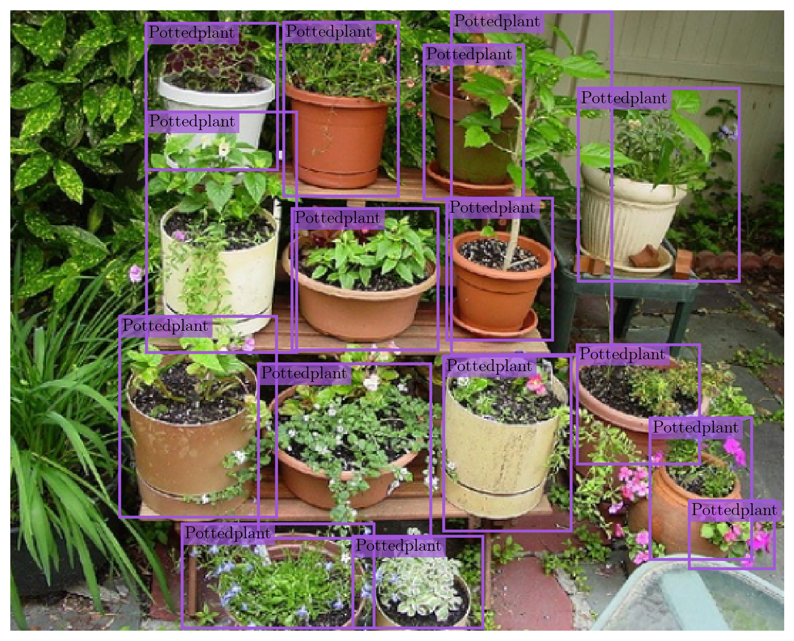

# A PyTorch Implementation of YOLOv3
This project uses the PyTorch framework to implement the YOLOv3 architecture, along with a training pipeline that incorporates various techniques (e.g. multiscale training, mosaic augmentations) to improve accuracy.

## Project Overview

WIP

## Recommended Installation Instructions
### 1) Create a New Python Environment
This environment should use **Python >= 3.10**.
### 2) Clone the `yolov3-pytorch` Repository
```
git clone git@github.com:Jechen00/yolov3-pytorch.git
```
### 3) Install Required Packages
Navigate to the `yolov3-pytorch` directory and run:
```
pip install -r requirements.txt
```
Alternatively, you may install the packages manually:
```
pip install matplotlib==3.10.3
pip install numpy==2.2.6
pip install pillow==11.2.1
pip install pyyaml==6.0.2
pip install seaborn==0.13.2
pip install torch==2.7.0
pip install torchvision==0.22.0
pip install torchmetrics==1.7.2
```

## Training Instructions
WIP